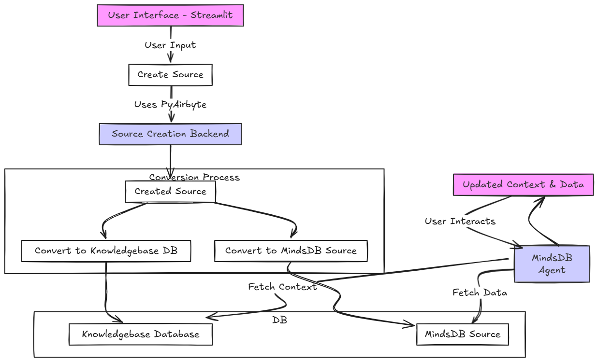

# 📚 Ragify

A modern, intuitive interface for building RAG-powered AI applications with MindsDB.

## 🚀 Features

- **🔌 Multi-Source Data Integration**: Connect to various data sources including Airbyte connections.
- **🧠 Smart Knowledge Base**: Automatically create and manage AI-powered knowledge bases.
- **💬 Interactive Chat**: Engage with your data through natural conversations.
- **🔧 No-Code Configuration**: Set up and manage your RAG system without writing code.
- **🎯 Precise Retrieval**: Get accurate, context-aware responses from your data.
- **🔄 Airbyte Integration**: Seamlessly fetch data from hundreds of sources using Airbyte.

## 🏃 Quick Start

0. **Clone & Install**
   ```bash
   git clone https://github.com/parthiv11/ragify.git
   cd ragify
   pip install -r requirements.txt
   ```

1. **Add .env**
   
   `copy`.env.example` and create `.evn` and populate it
   
3. **Run MindsDB**
   ```bash
   python -m mindsdb
   ```

4. **Run FastAPI**
   ```bash
   uvicorn main:app --reload
   ```

5. **Run Streamlit**
   ```bash
   streamlit run app.py
   ```

6. **Access the UI**
   Open [http://localhost:8501](http://localhost:8501) in your browser.

## 🛠️ Architecture

Ragify combines MindsDB's powerful RAG capabilities with a streamlined user interface:



## 📊 Data Integration

Ragify supports multiple ways to ingest your data:

1. **Airbyte Sources**
   - Connect to hundreds of data sources using Airbyte.
   - Automatic schema detection and data synchronization.
   - Real-time data updates.

2. **Direct Connections**
   - Native database connections.
   - File uploads.
   - API integrations.

3. **Knowledge Base Creation**
   - Automatic vector embedding.
   - Smart chunking and indexing.
   - Metadata extraction.

[Watch the demo video here](https://www.canva.com/design/DAGl47PWREY/7iLbQaCVHoP9IxEgYfpYsg/watch).

## 🤝 Contributing

Contributions are welcome! Please feel free to submit a Pull Request.

## 📝 License

[MIT License](LICENSE)

---
Built with ❤️ using MindsDB, Airbyte, and Streamlit.
